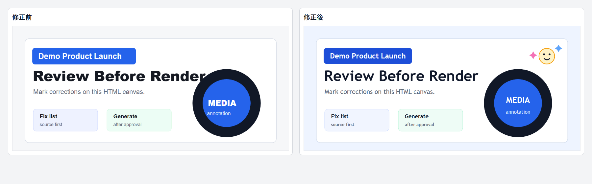
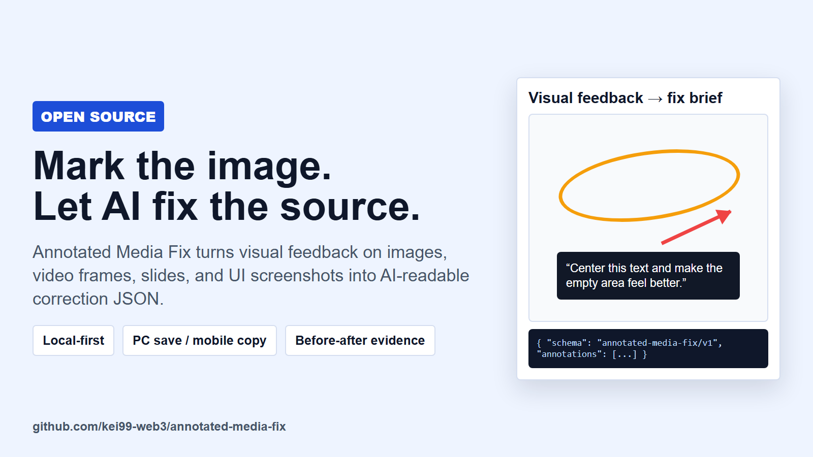

# Annotated Media Fix

[](https://github.com/kei99-web3/annotated-media-fix/actions/workflows/ci.yml)
[](LICENSE)

Turn visual feedback into AI-readable correction instructions.

Annotated Media Fix is a small local workflow for reviewing images, video frames, slides, banners, and UI screenshots. A reviewer marks the target area, writes a short note, and exports structured JSON that an AI coding or design agent can turn into a precise fix brief.

It is designed for the moment when comments like "move this text," "this area feels empty," or "make this part sharper" are easier to explain by pointing at the image than by describing coordinates in chat.

## What It Solves

- Visual feedback becomes structured JSON instead of vague chat text.
- PC users can save a local JSON file and let the AI agent read it.
- Mobile users can copy the JSON and paste it into chat.
- The agent can map every mark to a concrete fix, acceptance check, and source edit.
- Before/after renders can be kept as review evidence.

## Example

The example in `examples/` uses a synthetic banner and real-style review notes:

- `examples/original-demo-banner.png`: before
- `examples/fixed-demo-banner.png`: after
- `examples/comparison.png`: before/after comparison
- `examples/user-test-annotations.json`: exported annotation JSON
- `examples/user-test-fix-brief.md`: AI-readable fix brief

Example reviewer notes:

```text
文字がずれているので、円の真ん中に文字をちゃんと置いてください。

四角に対して文字がずれています。
四角を文字に合わせて小さくしてください。

このエリアが少し寂しいので、何か可愛らしいイラストを足しておいて。

この辺の書体とか、もう少し何かかっこよくしておいてほしい。
全体のトーンを合わせつつ、背景の色も変えておいて。
```

Result:



Launch card:



## Workflow

1. Generate or open a review canvas.
2. Mark an area with Area, Arrow, or Pen.
3. Write the correction note for that mark.
4. Export the annotation JSON.
5. Let the AI agent validate the JSON and produce a fix brief.
6. Apply deterministic edits in the editable source first.
7. Render before/after evidence.

## PC vs Mobile

PC is the preferred route:

1. Click `Save annotation JSON (PC)`.
2. Let the AI agent find the newest local export.
3. The agent validates and reads the file automatically.

Mobile is the fallback route:

1. Tap `Copy JSON (mobile)`.
2. Paste the JSON into the AI chat.
3. The agent validates the pasted JSON before editing.

## Scripts

Build a review canvas:

```bash
python scripts/build_review_canvas.py --media ./examples/demo-banner.svg --media-type image --out ./review.html --title "Banner review"
```

Find the newest local annotation export:

```bash
python scripts/find_latest_annotations.py --json
```

Validate an annotation bundle:

```bash
python scripts/validate_annotation_bundle.py --annotations ./examples/user-test-annotations.json --fix-brief ./examples/user-test-fix-brief.md
```

## Annotation Schema

```json
{
  "schema": "annotated-media-fix/v1",
  "media_type": "image",
  "media": {
    "src": "demo-banner.svg",
    "width": 1200,
    "height": 540,
    "timestamp": null
  },
  "annotations": [
    {
      "id": "a01",
      "type": "arrow",
      "x1": 255,
      "y1": 28,
      "x2": 285,
      "y2": 92,
      "note": "Center the text inside the circle.",
      "color": "#ff3b30"
    }
  ]
}
```

Supported `media_type`: `image`, `video`, `slide`, `storyboard`, `mixed`.

Supported annotation `type`: `rect`, `arrow`, `pen`.

## Release Scope

This repository is intentionally small. It does not include hosted accounts, image upload storage, authentication, or a public API. Those should be added only when a hosted review product is actually needed.

## License

MIT.
